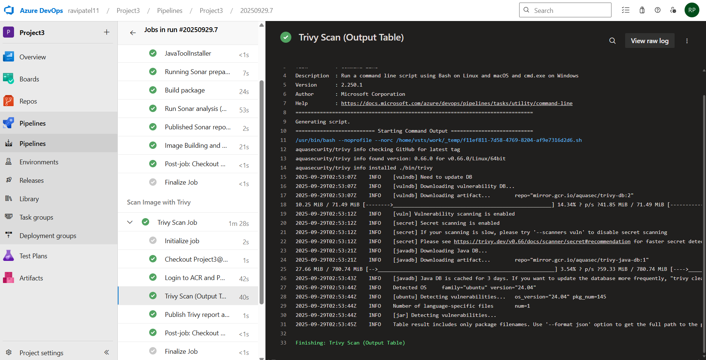

# Petclinic → AKS with Azure DevOps (ACR, Trivy, SonarCloud)

**Overview**
A production-style pipeline that builds and ships the Spring Petclinic app to Azure Kubernetes Service (AKS). The flow packages a Docker image, stores it in Azure Container Registry (ACR), scans it with Trivy, optionally checks code quality in SonarCloud, and deploys to AKS via a public LoadBalancer service.

---

## Architecture

**Flow**
1. Commit → Azure DevOps pipeline triggers.
2. CI: Maven build and tests → Docker image → push to ACR.
3. Security: Trivy scans the pushed image and publishes a report.
4. Quality (optional): SonarCloud analysis and Quality Gate.
5. CD: Apply Kubernetes manifests (Deployment + Service) to AKS.
6. Service type LoadBalancer exposes the app publicly.

---

## What’s included in this repo

- `diagram.png` — high-level architecture used above.
- `trivy-report.txt` — latest Trivy scan output for the built image.
- `Screenshots/azdevops.png` — Azure DevOps pipeline execution proof.
- `Screenshots/azure.png` — Azure Portal (AKS/ACR) evidence.
- `Screenshots/live.png` — Running application (external endpoint).
- `Screenshots/sonar.png` — SonarCloud project/dashboard view.

---

## Pipeline stages (high level)

**Build, Analyze & Push**
- Java 17 toolchain for the build  
- Maven compile and tests  
- (Optional) SonarCloud prepare + analysis  
- Build Docker image and push to ACR

**Trivy Scan**
- Pull the image from ACR  
- Trivy image scan  
- Publish `trivy-report.txt` as build artifact

**Deploy to AKS**
- Authenticate to AKS  
- Apply Kubernetes manifests  
- Verify rollout and external IP on the LoadBalancer service

---

## Security & quality

- **Trivy** ensures the container image is scanned for vulnerabilities (see `trivy-report.txt`).  
- **SonarCloud** (optional) enables a Quality Gate before deployment.  
- **ACR** + AKS identity/permissions restrict image pull to the cluster.

---

## Evidence

**Azure DevOps pipeline**  

**Azure Portal (AKS / ACR)**  

**Live application**  

**SonarCloud project**  

---

## Troubleshooting notes

| Symptom                        | Likely Cause                              | Fix applied                                      |
|-------------------------------|-------------------------------------------|--------------------------------------------------|
| Image pull errors             | Wrong repo/tag or AKS not attached to ACR | Corrected image path and ensured ACR attachment  |
| External IP stays “pending”   | Load balancer not yet provisioned         | Confirmed node RG & permissions; waited for LB   |
| Pods stuck Pending            | Node capacity or node readiness           | Verified node pool status; scaled if necessary   |
| Sonar shows “Not computed”    | Keys/org mismatch or first-time run       | Verified org/key; triggered a fresh analysis     |

---

## Result

- End-to-end CI/CD from commit to running workload on AKS  
- Security scanning baked into the pipeline  
- Optional Quality Gate for code health  
- Public access via Kubernetes LoadBalancer service  
- Clear evidence of each stage via screenshots and reports

## License

MIT — feel free to use, adapt, and learn from this project.
